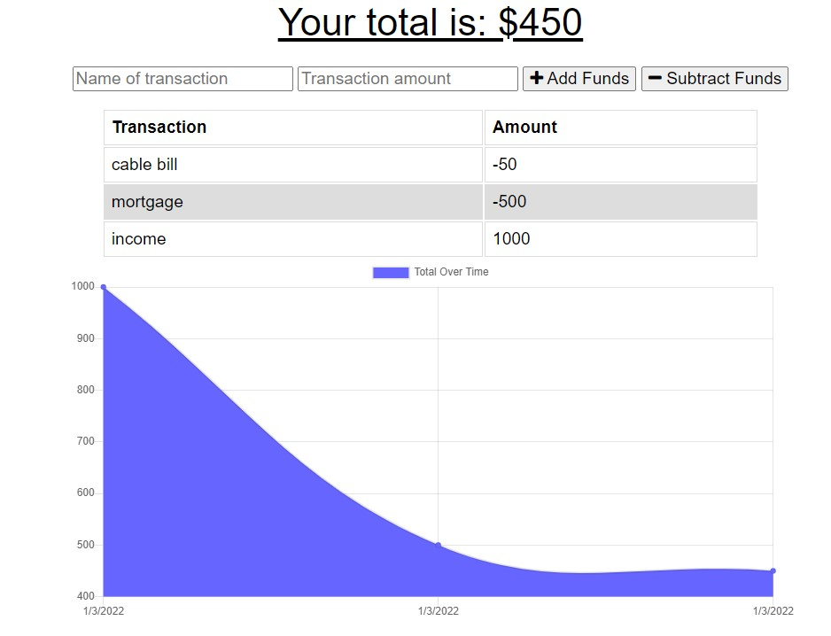

# progressive-budget

PWA budget tracker

## Overview

The app allows users to track their expenses and income, then charts the net balance over time.

If the user is offline, the browser stores the transactions locally until connection can be restored.

[Deployed Version](https://sosebee-budget-tracker.herokuapp.com/)

[GitHub Repo](https://github.com/steven-sosebee/progressive-budget)

## Technology Used

The app uses Node.js to run the server. The back-end is hosted on MongoAtlas and uses a NoSQL collection.

## Contact

For collaboration or questions, please reach out to:

swsosebee@gmail.com

https://github.com/steven-sosebee
